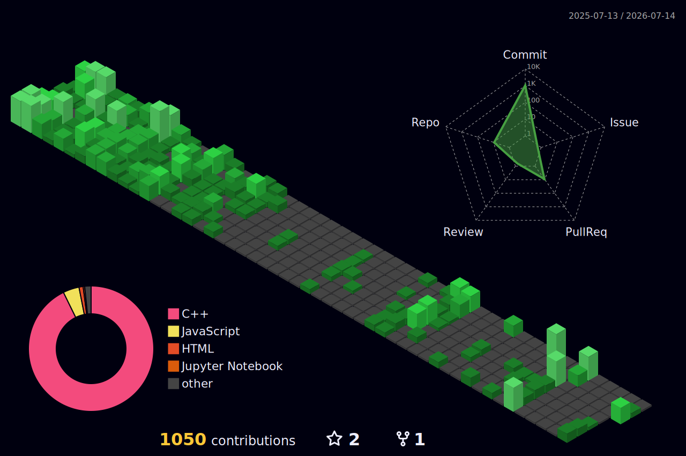

<h1 align="center">👋 Hi, I'm Balpreet Singh</h1>

<h3 align="center">
  An aspiring software engineer passionate about AI, Full-Stack Development, and Backend Engineering.
</h3>

<h1>📊 GitHub Isometric Contribution Calendar</h1>

  

<h1>💻 Tech Stack</h1>

  
  
  
  
  
  
  
  
  
  
  
  
  
  
  
  
  
  
  
  
  
  
  
  
  

<h1>📊 GitHub Stats</h1>

  
    
  
    
  

<h1>💻 Coding Profiles</h1>

  

  

  

  

  

<h1>🌐 Socials</h1>

  

  

