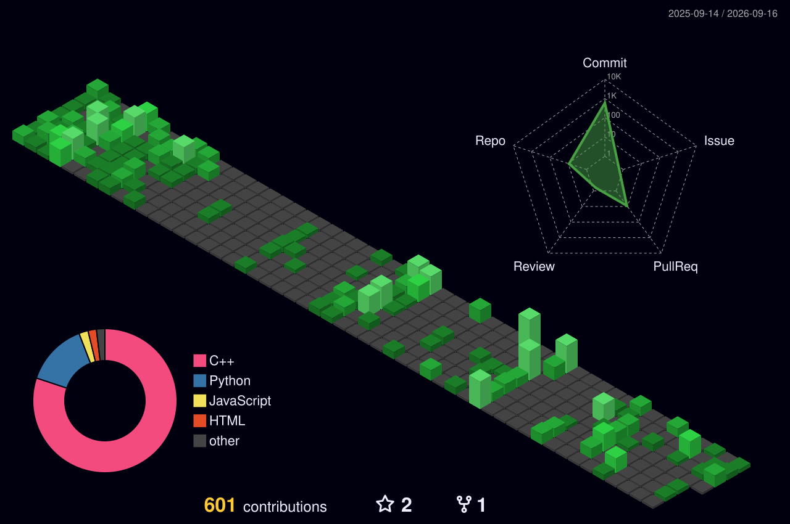

<h1 align="left">👋 Hi, I'm Balpreet Singh</h1>

<h3 align="left">
  An aspiring software engineer passionate about AI, Full-Stack Development, and Backend Engineering.
</h3>

# 📊 GitHub Isometric Contribution Calendar:

<!-- 

  

 -->

  

# 💻 Tech Stack:

# 📊 GitHub Stats:
 
 

# 💻 Coding Profiles:

# 🌐 Socials:

<!-- Proudly created with GPRM ( https://gprm.itsvg.in ) -->
